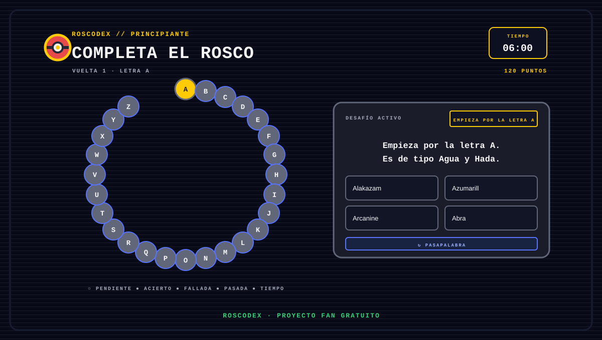

# ⚡ Roscodex ⚡

### El desafío pixel-art de las letras

  

  <a href="https://bertmarti.github.io/Roscodex/"><strong>▶ Jugar a Roscodex</strong></a>

> Proyecto fan no oficial, gratuito y sin ánimo de lucro. Pokémon y sus personajes pertenecen a sus respectivos titulares.

## 🌍 ¿Qué es Roscodex?

Roscodex es un juego de preguntas tipo rosco inspirado en el formato televisivo “Pasapalabra”, reinterpretado con temática Pokémon y una interfaz pixel-art retro.

El objetivo es completar las letras de la A a la Z antes de que se termine el tiempo. Cada pregunta tiene cuatro respuestas posibles y una opción de **Pasapalabra** para dejarla para la segunda vuelta.

## 🕹️ Cómo funciona

1. Elige una dificultad.
2. Lee la regla de la letra activa.
3. Selecciona una de las cuatro respuestas.
4. Usa **Pasapalabra** si quieres volver a esa letra más tarde.
5. Completa la segunda vuelta antes de que se agote el tiempo.

Las respuestas correctas se marcan en verde, las incorrectas en rojo y las preguntas pasadas quedan reservadas para la siguiente vuelta.

## 🎚️ Dificultades

| Nivel | Tiempo | Tipo de preguntas |
|---|---:|---|
| 🟢 Principiante | 6:00 | Tipos y generaciones, sin datos técnicos complejos |
| 🔵 Normal | 5:00 | Datos combinados y algún dato técnico sencillo |
| 🟠 Difícil | 4:00 | Varias condiciones, estadísticas, habilidades o movimientos |
| 🔴 Extremo | 3:00 | Combinaciones avanzadas de datos de combate |

En Principiante no aparecen peso, altura, número de Pokédex, experiencia base, estadísticas, movimientos ni habilidades.

## 🔤 Reglas del rosco

Cada pregunta sigue siempre uno de estos formatos:

- **Empieza por la letra X.** La respuesta comienza por esa letra.
- **Contiene la letra X.** La respuesta contiene esa letra en cualquier posición.

Cada rosco contiene 18 preguntas “Empieza por” y 8 preguntas “Contiene”, el reparto entero más cercano al 70/30 en 26 letras.

## 🔁 Preguntas sin repetición

Roscodex cuenta con un banco local de 2.080 preguntas:

- 520 por dificultad.
- 20 candidatas para cada letra dentro de cada nivel.
- Selección de una pregunta nueva por letra en cada partida.

El historial se guarda en el navegador para evitar repetir automáticamente las preguntas utilizadas. Cuando una dificultad se agota, la aplicación lo comunica y solo permite reiniciar la rotación mediante una acción explícita.

## 🎨 Identidad visual

La interfaz de Roscodex está construida alrededor de una pantalla de juego compacta y legible:

- Fondo oscuro con scanlines CRT y sprites pixelados.
- Cabecera con dificultad, ronda, puntuación y temporizador.
- Rosco circular de fichas planas con mini Poké Balls semitransparentes.
- Letra activa resaltada en amarillo.
- Tarjeta de desafío con borde gris, regla amarilla y respuestas en cuadrícula.
- Estados claros para acierto, fallo, pasada y tiempo agotado.
- Diseño responsive para móvil, tablet y escritorio.

## 🌐 Demo online

👉 [Abrir Roscodex en GitHub Pages](https://bertmarti.github.io/Roscodex/)

La demo funciona sin cuentas, sin publicidad y sin backend obligatorio. Las preguntas, sprites y recursos necesarios para jugar están incluidos localmente en la aplicación publicada.

## 🔗 Fuentes y créditos

- [PokéAPI](https://pokeapi.co/) — datos estructurados de Pokémon.
- [PokéAPI Sprites](https://github.com/PokeAPI/sprites) — sprites cacheados para la demo.
- [Press Start 2P](https://fonts.google.com/specimen/Press+Start+2P) — tipografía pixel de interfaz.

Roscodex no está afiliado, patrocinado ni aprobado por Nintendo, Creatures Inc., GAME FREAK inc. ni The Pokémon Company.

## 🗺️ Estado del proyecto

- [x] Demo web publicada en GitHub Pages.
- [x] Cuatro dificultades con tiempos diferenciados.
- [x] Rosco circular A-Z con estados visuales.
- [x] Banco local de 2.080 preguntas.
- [x] Rotación persistente sin repetición automática.
- [x] Validación automática y simulación de partidas.
- [ ] Revisión editorial humana de todas las preguntas.
- [ ] Normalización de nombres de movimientos y habilidades.
- [ ] Portar la experiencia a Flutter para Android/iOS.
- [ ] Modo práctica sin temporizador.
- [ ] Récords locales y estadísticas personales.

## ❤️ Nota final

Roscodex es una experiencia experimental hecha para aprender, jugar y explorar una interfaz de rosco con estética pixel-art. Está pensada para mantenerse gratuita.
